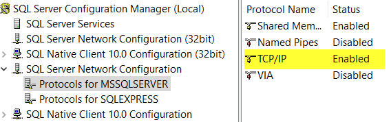

# MySQL-to-MSSQL
This is a simple server for synchronizing changes (CUD operations) from MySQL source database to MSSQL target database.   

The architecture is simple:
1. parser: listen to changes from source db (via binlog)
2. changes will be logged into an embedded database
3. syncer: scan the log store & sync logged events to target db on a fixed interval
## DEMO:
**MYSQL**
1. Set up local MYSQL instance with user **root/root**
2. Use the `staff` table in `sakila` schema that comes with MySQL 8.0 installation package (demo db)  
**MSSQL**
1. Set up local MSSQL instance (2008+)
2. <details>
    <summary>Enable TCP/IP in Configuration Manager</summary>

       
    </details>
3. <details>
        <summary>Create table <b>Staff</b> with same column names as MYSQL</summary>

    ```sql
    CREATE TABLE [dbo].[Staff](
        [staff_id] int NOT NULL primary key,
        [first_name] varchar(50) NOT NULL,
        [last_name] varchar(50) NOT NULL,
        [address_id] smallint NOT NULL,
        [picture] varbinary(max) NULL,
        [email] varchar(50) NULL,
        [store_id] smallint NOT NULL,
        [active] bit NOT NULL,
        [username] varchar(50) NULL,
        [password] varchar(50) NULL,
        [last_update] [datetime] NOT NULL,
    )
    ALTER TABLE [dbo].[Staff] SET (LOCK_ESCALATION = AUTO)
    ```
    </details>
**GO**
1. Install [go 1.14 amd64](https://golang.org/dl/go1.14.12.windows-amd64.msi). **Note that this library has not work with go >=1.15 yet, and it does not support 32-bit platforms** :warning:
2. Clone this repo to local machine, example: `d:\demo`
3. CD into directory (`cd d:\demo`)
4. Execute `go run .` It should start the Echo server
5. <details>
    <summary>
        Send a POST request to <code>/struct/put</code> to let server knows about the table structure. 
        For details about type enum, see <a href="./db/types.go">db/types.go</a>
    </summary>
    
    ```json
    //deliberately removed "username" & "password" from the request, so these 2 fields won't be synced
    {
        "table":"staff",
        "columns": [
            {
                "name": "staff_id",
                "type": 1,
                "is_primary": true // currently a PK must be defined, otherwise server won't know how to handle update/delete
            },
            {
                "name": "first_name",
                "type": 5
            },
            {
                "name": "last_name",
                "type": 5
            },
            {
                "name": "picture",
                "type": 18
            },
            {
                "name": "address_id",
                "type": 1
            },
            {
                "name": "store_id",
                "type": 1
            },
            {
                "name": "email",
                "type": 6
            },
            {
                "name": "last_update",
                "type": 9
            },
            {
                "name": "active",
                "type": 7
            }
        ]
    }
    ``` 
    </details>
6. <details>
    <summary>
        Send a POST request with MySQL db info to <code>/parser/start</code> to start listening for changes
    </summary>
    
    ```json
    {
	    "server_id": 1,
	    "addr": "127.0.0.1:3306",
	    "user": "root",
	    "password": "root",
	    "use_decimal": true,
	    "include_table_regex": ["sakila\\.staff"] //listen to changes from sakila.staff table only!
    }
    ```
    </details>
7. <details>
    <summary>
        Send another POST request with MSSQL db info to <code>/syncer/start</code> to start syncing changes received from <i>parser</i>
    </summary>
    
    ```json
    {
        "server": "127.0.0.1",
        "database": "master", //where Staff table is
        "log": 63, //full logging
        "appname": "mysql-to-mssql" //the programe_name in dm_exec_sessions
    }
    ```
    </details>
##### :fire: Make changes & see sync :fire:
## FAQ:
#### 1. Why not SSIS?
- No real time support
- Incremental load requires something like `lastupdated` column from source table

#### 2. Why not trigger?
- Hard to maintain, you may not have full control to this trigger
- SQL Developers might be unaware of this side effect
- Slower performance (for example, trigger fires whenever a row is updated, whereas binlog only capture the final commited data once)