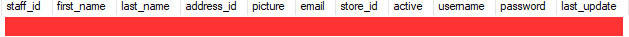

## DEMO:
### Set up:

#### MYSQL
1. Set up local MYSQL 8.0 instance with user **root/root**
2. Use the `staff` table in `sakila` schema that comes with MySQL 8.0 installation package (demo db)  
    Or create the table:
    ```
    CREATE TABLE `staff` (
        `staff_id` tinyint unsigned NOT NULL AUTO_INCREMENT,
        `first_name` varchar(45) NOT NULL,
        `last_name` varchar(45) NOT NULL,
        `address_id` smallint unsigned NOT NULL,
        `picture` blob,
        `email` varchar(50) DEFAULT NULL,
        `store_id` tinyint unsigned NOT NULL,
        `active` tinyint(1) NOT NULL DEFAULT '1',
        `username` varchar(16) NOT NULL,
        `password` varchar(40) CHARACTER SET utf8 COLLATE utf8_bin DEFAULT NULL,
        `last_update` timestamp NOT NULL DEFAULT CURRENT_TIMESTAMP ON UPDATE CURRENT_TIMESTAMP,
        PRIMARY KEY (`staff_id`),
        KEY `idx_fk_store_id` (`store_id`),
        KEY `idx_fk_address_id` (`address_id`),
        CONSTRAINT `fk_staff_address` FOREIGN KEY (`address_id`) REFERENCES `address` (`address_id`) ON DELETE RESTRICT ON UPDATE CASCADE,
        CONSTRAINT `fk_staff_store` FOREIGN KEY (`store_id`) REFERENCES `store` (`store_id`) ON DELETE RESTRICT ON UPDATE CASCADE
    ) ENGINE=InnoDB
    ```

#### MSSQL
1. Set up local MSSQL instance (2008+)
2. Enable TCP/IP in Configuration Manager   
   
3. Create database `gonnextor`, create `staff` table with same column names as MYSQL
    ```
    CREATE TABLE [dbo].[Staff](
        [staff_id] int NOT NULL primary key,
        [first_name] varchar(50) NOT NULL,
        [last_name] varchar(50) NOT NULL,
        [address_id] smallint NOT NULL,
        [picture] varbinary(max) NULL,
        [email] varchar(50) NULL,
        [store_id] smallint NOT NULL,
        [active] bit NOT NULL,
        [username] varchar(50) NULL,
        [password] varchar(50) NULL,
        [last_update] [datetime] NOT NULL,
    )
    ALTER TABLE [dbo].[Staff] SET (LOCK_ESCALATION = AUTO)
    ```
#### GO
1. Install [go 1.14 amd64](https://golang.org/dl/go1.14.12.windows-amd64.msi). **Note that this library has not work with go >=1.15 yet, and it does not support 32-bit platforms** :warning:
2. Clone this repo to local machine, example: `d:\demo`
3. CD into directory (`cd d:\demo`)
4. In `Staff.go`, define the data model that matches with `staff` table schema structure.
    ```
    type StaffModel struct {
        StaffID     int       `gorm:"column:staff_id"`
        FirstName   string    `gorm:"column:first_name"`
        LastName    string    `gorm:"column:last_name"`
        AddressID   int       `gorm:"column:address_id"`
        Email       *string   `gorm:"column:email"`
        Picture     *[]byte   `gorm:"column:picture"`
        StoreID     int       `gorm:"column:store_id"`
        Active      bool      `gorm:"column:active"`
        UserName    *string   `gorm:"column:username"`
        Password    *string   `gorm:"column:password"`
        LastUpdated time.Time `gorm:"column:last_update"`
    }
    ```
    More about [parser](https://gitlab.nexdev.net/jaden.tang/gonnextor/-/tree/master/mysql/parser)
5. In `main.go`, check the configurations:
    ```
    mysql := &parser.Config{
        ServerID:          1,
        Addr:              "127.0.0.1:3306",
        User:              "root",
        Password:          "root",
        Flavor:            "mysql",
        IncludeTableRegex: []string{"sakila\\.staff"}, // We only listen to changes on table staff
    }
    ```
    ```
    sqlserver := &syncer.Config{
		Server:   "127.0.0.1",
		Database: "gonnextor", // if Userid is not defined, default to single sign on
	}
    ```
    Then the table name - data model mapping configuration (table name string is case-sensitive):
    ```
    var dataModels = map[string]interface{}{
        "staff": &StaffModel{},
    }
    ```
6. Execute `go run .`
   
    It should display information about the Masterposition of MYSQL binlog & start listening for changes

#### Make changes

##### Insert 1 row on MYSQL:
```
INSERT INTO sakila.staff (first_name, last_name, address_id, email, store_id, username, picture)
SELECT 'Jaden', 'Tang', 1, 'Jaden.Tang@nexcel.vn', 1, 'go', (SELECT picture FROM sakila.staff where staff_id = 1);
```
   
#### -> Receive 1 row on MSSQL:
   

##### Update 1 row on MYSQL:
```
UPDATE sakila.staff SET first_name = 'XXX', active = 0 WHERE staff_id = 10;
```
   
#### -> corresponding row updated on MSSQL:
   

##### Delete 1 row on MYSQL:
```
DELETE FROM sakila.staff WHERE staff_id = 9;
```
   
#### -> corresponding row deleted on MSSQL:
   

## FAQ:
#### 1. Why not SSIS?
- No real time support
- Incremental load requires something like `lastupdated` column from source table

#### 2. Why not trigger?
- Hard to maintain
- Side effects
- Slower performance (for example, trigger fires whenever a row is updated, whereas binlog only capture the final commited data once)

#### 3. Why choose this library?
- Listen to live-changes directly from binlog
- Support all versions of MYSQL, MSSQL databases
- Both [go-mysql](https://github.com/siddontang/go-mysql) & [go-mssqldb](https://github.com/denisenkom/go-mssqldb) are maintained regularly
- Go: Procedural languague, suitable for developers with PL/SQL, T-SQL background; Easy to learn
- Highly scalable (we can listen to binlog from a MySQL replica node instead of main source to mitigate performance impact)
- Easier to test, easy to install

## Benchmark:
Here's the result of syncing ~7500 rows from MySQL to MSSQL, each row sized 2700 bytes (total **~20MB** worth of data)

- CPU Time: **~4s**
- Memory footprint: **~180MB**


## MILESTONE:
- [x] MySQL connector to listen to binlog (/mysql/parser)
- [x] MSSQL connector to sync changes from MySQL
- [x] MySQL connector support more than 1 source table
- [ ] Add Fault-tolerance to MSSQL syncer (implement "LogStore" & re-sync after target is back online)