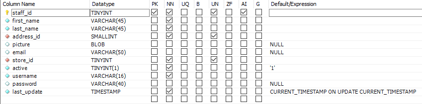
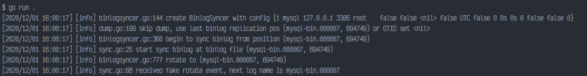
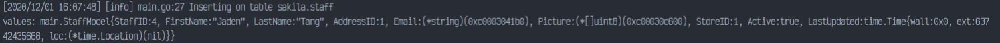

## 1. Set up MYSQL on localhost (3306) with sample database (sakila)
"staff" table's structure   
   
maps to the following model:
```
// we didn't include username/password here, but it should still work
type StaffModel struct {
	StaffID     int       `gorm:"column:staff_id"`
	FirstName   string    `gorm:"column:first_name"`
	LastName    string    `gorm:"column:last_name"`
	AddressID   int       `gorm:"column:address_id"`
	Email       *string   `gorm:"column:email"`
	Picture     *[]byte   `gorm:"column:picture"`
	StoreID     int       `gorm:"column:store_id"`
	Active      bool      `gorm:"column:active"`
	LastUpdated time.Time `gorm:"column:last_update"`
}
```

## 2. Execute `go run .`


## 3. Insert one row to table
```
INSERT INTO sakila.staff (first_name, last_name, address_id, email, store_id, username, picture)
SELECT 'Jaden', 'Tang', 1, 'Jaden.Tang@nexcel.vn', 1, 'go', (SELECT picture FROM sakila.staff where staff_id = 1);
```

## 4. Receive event

